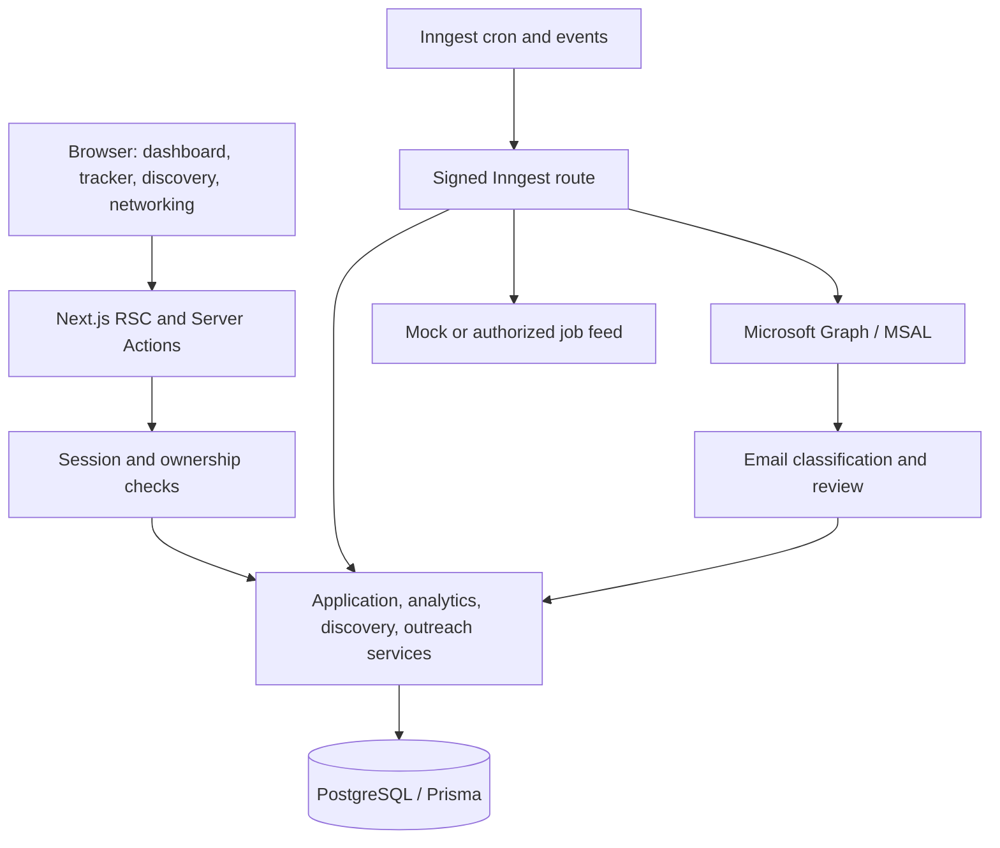

# Architecture

> This document describes the target design. See [WEEK_TWO.md](WEEK_TWO.md) for the current milestone and [IMPLEMENTATION.md](IMPLEMENTATION.md) for the delivered Week 1 behavior and explicit differences, including Better Auth storage and initial analytics.

## Decision: a modular Next.js monolith

Use one TypeScript repository and one PostgreSQL database. React Server Components query user-scoped services on the server; interactive Kanban and Recharts components receive serializable view models. Server Actions authenticate, validate with Zod, authorize ownership, and call domain services. Route Handlers expose OAuth callbacks, health checks, and the signed Inngest endpoint. All database, secrets, and integration modules are server-only.

Inngest hosts scheduling, retries, and durable execution; functions run through the application's HTTP endpoint. Choose it over BullMQ to avoid managing Redis and a persistent worker fleet during this one-month project. Keep domain services independent of the workflow SDK.

## Modules and interfaces

| Module        | Responsibility                                           | Boundary                                                                                 |
| ------------- | -------------------------------------------------------- | ---------------------------------------------------------------------------------------- |
| Applications  | CRUD, stage transitions, table filters, pagination       | `createApplication`, `moveApplication(id, expectedVersion, stage)`, `archiveApplication` |
| Analytics     | Cohort metrics, daily buckets, stage history             | `getDashboard(userId, dateRange, timezone)`                                              |
| Discovery     | Search profiles, scoring, deduplication, save-to-tracker | `JobProvider.search(profile, cursor)`                                                    |
| Outlook       | Connect/disconnect, token cache, folder delta sync       | `connect`, `syncFolder`, `disconnect`                                                    |
| Email signals | Match message to application, classify, review           | `classify`, `acceptSignal`, `dismissSignal`                                              |
| Networking    | Provenance-backed contact records, editable drafts       | `generateDraft(application, contact, resumeContext)`                                     |

## Data model and invariants

The Prisma schema defines 16 models: User, Identity, Session, Application, StageEvent, SearchProfile, DiscoveredJob, JobMatch, OutlookConnection, MailSyncCursor, EmailSignal, Contact, OutreachDraft, WorkflowRun, and AuditLog.

- User is the ownership root. Identity stores provider subject identifiers, not provider access tokens. Session stores only hashed opaque session tokens.
- Applications have an explicit current stage and immutable stage events for historical analytics. An optimistic `version` prevents two browser tabs or an email sync from silently overwriting each other.
- Stage mutation, event insertion, timestamp changes, and audit append occur in one transaction. A repeated idempotency key returns the original result. Manual backward moves are permitted and audited; automatic moves must not overwrite newer manual edits or terminal stages.
- `appliedAt` is the actual submission timestamp, never the creation timestamp. Wishlist is excluded from submission metrics. Imports into later stages require an explicit submission date, or remain outside date-based cohorts until one is supplied.
- Job listings deduplicate by user/provider/external ID; JobMatch supports multiple matching profiles without duplicate cards. One listing can produce one application; manually entered reapplications remain possible.
- Outlook cursors are per folder. Signals deduplicate using connection plus immutable message ID. Disconnection deletes token cache, cursors, and signals; existing application history remains.
- Cross-model ownership (application↔listing, signal↔application, profile↔job, draft↔contact) must be validated in the same service transaction. The initial schema's foreign keys enforce existence, not same-user ownership. Cross-user integration tests are a release gate.
- Zod and SQL CHECK constraints in the first migration enforce nonnegative salary bounds, min ≤ max, confidence/score in [0,1], and response ≥ application date. These CHECK constraints are planned; Prisma schema validation alone does not enforce them.

## Background discovery

Hourly cron (`0 * * * *`, UTC) pages through enabled profile IDs, then dispatches a per-profile event. Each function reloads the profile and user, applies per-provider rate limits, fetches a bounded batch, normalizes URLs and external IDs, scores matches, upserts listings/matches, and records a run. Use deterministic mock fixtures for the initial demo. Dedupe keys include profile ID and hour; row upserts remain necessary because delivery can repeat. Disable profiles before dispatch and recheck within the function.

LinkedIn does not permit third-party scraping/automation of its website. Use simulated LinkedIn-style alerts initially, user-provided listings, or an explicitly authorized feed adapter. Real LinkedIn search access is not assumed. Networking discovery starts with user-entered LinkedIn links and contacts from permitted sources; show source provenance and never invent a person's identity. Outreach generation uses deterministic templates grounded in provided resume/JD facts and stays editable; sending remains a user action.

## Outlook integration

Use MSAL with authorization-code flow + PKCE, random one-time state bound to the authenticated session, and OIDC nonce validation. Application login and mailbox consent are separate operations. Request delegated `openid profile email offline_access Mail.Read`; do not request mail-send access. Match accounts by validated provider subject, never by an unverified email claim.

Store the serialized MSAL token cache using authenticated AES-256-GCM encryption and a versioned key from the deployment secret manager. Lock refresh/cache writes per connection. Never serialize tokens to browser props, events, or logs. Re-consent must be bound to the current user; `invalid_grant` marks reconnect required. Disconnect cancels future work and wipes stored credentials.

Every 15 minutes, dispatch per-connection sync events with concurrency one per connection. Read Inbox delta pages using `Prefer: IdType="ImmutableId"`. Process bounded pages, commit signals and continuation progress atomically, and store the final delta link only after the round completes. Use bounded retries for 429/5xx, honor Retry-After, and restart bounded initial sync on expired delta state. Default initial coverage: last 30 days in Inbox; other folders and historical import are explicit future options. Restrict continuation URLs to the expected Graph HTTPS origin.

Parse message content transiently. Store classification reason codes, immutable ID, timestamps, confidence, and proposed stage; avoid persisting raw bodies. Match requisition IDs or known application/thread evidence before keywords. Generic ATS sender domains are insufficient. Treat “offer”, “moving forward”, and negation cautiously. Auto-accept only exact application matches with calibrated high confidence and a valid transition; otherwise create a review item. Initial implementation runs review-only until classifier fixtures prove precision. Automated acknowledgments do not count as substantive responses.

## Analytics definitions

All headline conversion metrics use the same submitted cohort: applications with `appliedAt` in the selected range. Interpret date boundaries in the user's timezone, then query UTC timestamps; use a half-open interval [start, end). Empty denominators display 0% with sample size 0; missing response-time data displays “—”.

| Metric                 | Definition                                                                                                    |
| ---------------------- | ------------------------------------------------------------------------------------------------------------- |
| Total applied          | Number of applications in the submitted cohort                                                                |
| Interview conversion   | Cohort applications ever reaching Screening, Technical, or Offer ÷ cohort size                                |
| Response rate          | Cohort applications with a substantive `firstResponseAt` ÷ cohort size                                        |
| Active pipelines       | Current nonarchived Applied/Screening/Technical applications, across all dates; label this separately         |
| Average response time  | Mean elapsed hours from appliedAt to firstResponseAt among responded cohort applications                      |
| Applications over time | Count by appliedAt, grouped by local week/month, including zero buckets                                       |
| Status breakdown       | Cohort current stages; Screening/Technical displayed as Interviewing                                          |
| Funnel                 | Cohort ever reaching Applied → Interviewing → Offer; later-stage evidence implies preceding funnel milestones |

Offer implies a response; manual transitions ask for the effective response date. Rejected after interviewing still counts toward interview conversion. Archived applications stay in historical metrics; hard deletion removes them. Add a tracked Wishlist count outside the submission cohort. Use indexed SQL aggregation on demand first; materialized views are unnecessary at personal scale.

## Production release gates

Authenticate every action, scope every read/write by server-derived user ID, validate job payload ownership, and verify Inngest signatures. Enforce CSRF/origin checks and secure HttpOnly SameSite cookies. Test tenant isolation, duplicate deliveries, out-of-order emails, token refresh failure, and concurrent edits. Redact structured logs, correlate workflow IDs, retain operational logs for 30 days, and include account export/deletion. Add accessible keyboard stage controls alongside drag-and-drop, loading/error/empty states, connection health, and last-sync timestamps.

Deploy with pooled PostgreSQL runtime connections and a direct migration connection where required. Use expand/contract migrations, daily managed backups, and a demonstrated restore. Set initial targets of p95 dashboard response <1s on a seeded 10,000-application dataset and discovery freshness <90 minutes; measure these before claiming them. Monitor error rate, workflow failures, stale cursors, and database pool saturation. Demo mode must use isolated synthetic data and cannot expose real mail or resumes.

## Primary references

- [Next.js Server Components](https://nextjs.org/docs/app/getting-started/server-and-client-components)
- [Prisma configuration](https://www.prisma.io/docs/orm/reference/prisma-config-reference)
- [Inngest retries](https://www.inngest.com/docs/guides/error-handling) and [concurrency](https://www.inngest.com/docs/guides/concurrency)
- [Microsoft authorization-code flow](https://learn.microsoft.com/en-us/entra/identity-platform/v2-oauth2-auth-code-flow)
- [Microsoft message delta sync](https://learn.microsoft.com/en-us/graph/delta-query-messages)
- [LinkedIn prohibited software](https://www.linkedin.com/help/linkedin/answer/a1341387/prohibited-software-and-extensions?lang=en)
